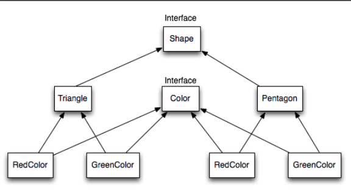

# Bridge pattern
_"Decouple the functional abstraction from the implementation so that the two can vary independently"_

`
public interface Color {
String fill();
}
public class Blue implements Color {
@Override
public String fill() {
return "Color is Blue";
}
}
public abstract class Shape {
protected Color color;
public Shape(Color color) {
this.color = color;
}
abstract public String draw();
}
public class Square extends Shape {
public Square(Color color) {
super(color);
}
@Override
public String draw() {
return "Square drawn. " + color.fill();
}
}
`
In this example, we have two layers of abstraction: geometric shapes and colors. 
The Color interface is implemented by the Blue class, which returns the color blue. 
The Shape abstract class has a reference to the Color object and an abstract draw() method. 
The Square class extends the Shape class and utilizes the fill() method from the Color interface.
To use the Bridge pattern, we can pass the desired color object to the Square class
`
Shape square = new Square(new Red());
assertEquals(square.draw(), "Square drawn. Color is Red");
`

