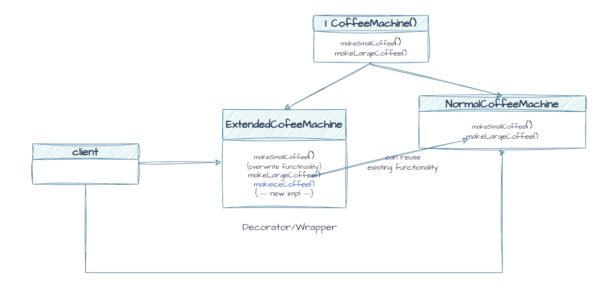

# Decorator Pattern 
The Decorator pattern is a design pattern that allows us to add new functionality to an existing object without altering its structure. 
It is a structural pattern that provides a wrapper to the existing class. 
The decorator design pattern uses abstract classes or interfaces with the composition to implement the wrapper

In simple words, **the decorator pattern is a way to add new functionality to an existing object without changing the original object.** 
It is like wrapping a gift with different layers of paper and ribbons. Each layer adds something new to the gift, but the gift itself remains the same

