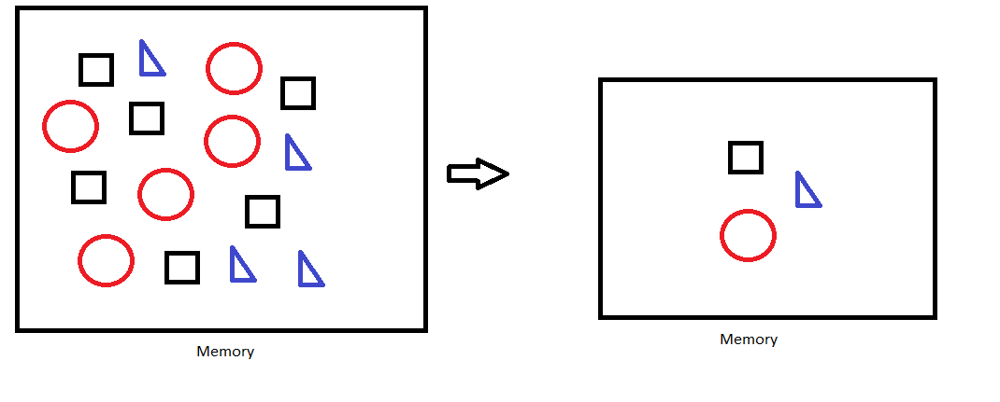

# Fly weight
The Flyweight design pattern is a structural pattern that is used to minimize memory usage or computational expenses by sharing as much as possible with other similar objects.

The key idea behind the Flyweight pattern is to use shared objects to support large numbers of fine-grained objects efficiently.

EG.,
1. Say you have to store elements in memory that are to be displayed on monitor
2. It would be overhead to store all the data in memory
3. To improve efficiency, we can identify the distinct elements 

